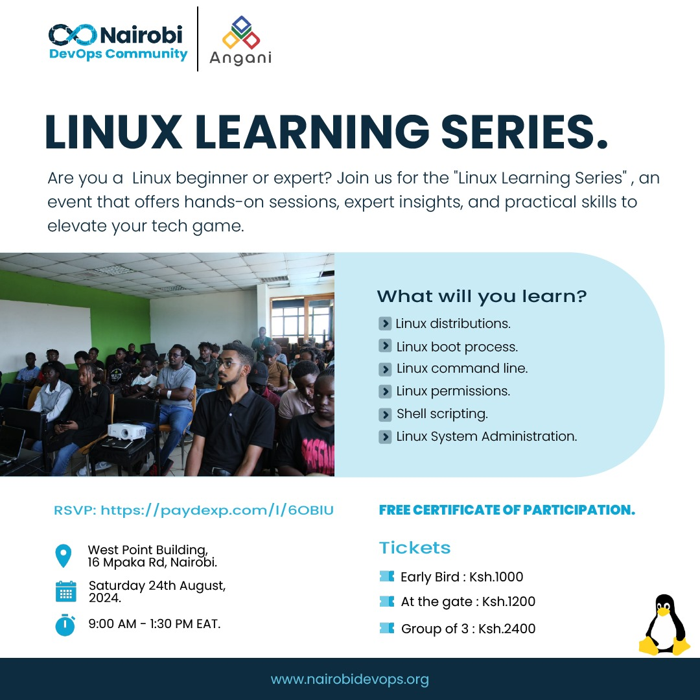

# NDC Linux Learning Series

Welcome to the **Linux Learning Series**! This series is designed to take you from the basics of Linux to more advanced concepts, providing you with the knowledge and skills needed to effectively use and manage Linux systems. 

## Why Learn Linux?

Linux is a powerful, open-source operating system widely used in servers, cloud computing, embedded systems, and even on desktops. It is known for its security, stability, and flexibility, making it a popular choice for developers, system administrators, and tech enthusiasts. Learning Linux can open up many opportunities in the IT world, as it is a critical skill for many technical roles.

## What You'll Learn

Throughout this series, you'll explore a variety of topics, including:

- **Linux Basics and Command Line**: Understanding the Linux environment, using the terminal, and mastering essential commands.
- **Shell Scripting and Automation**: Automating tasks with shell scripts and managing processes efficiently.
- **System Administration and Networking**: Managing users, groups, software, and network configurations.
- **Security and Permissions**: Implementing security best practices, managing file permissions, and using secure remote access tools.

## Prerequisites

Before you start this series, it would be helpful to have:

- **Basic Computer Skills**: Familiarity with general computer concepts and terminology.
- **Access to a Linux Environment**: You can use a Linux distribution like Ubuntu, Fedora, or CentOS, or even a virtual machine running Linux.
- **Willingness to Learn**: A curiosity and eagerness to explore the Linux operating system and its capabilities.

No prior experience with Linux is required, but if you have some knowledge of the command line or other operating systems, it will be beneficial.

---

## Program

## Access Linux Terminal Online

1. Visit [www.webminal.org](https://www.webminal.org/)
2. Click on `Terminal` to launch the terminal
3. Register 
4. Verify your accout and Login

## Learn Shell Scripting

1. Visit [Shell-scripting-ii](https://github.com/kadimasum/shell-scripting-ii)

## Linux Learning Series Slides

1. Linux Basics [Slides](https://docs.google.com/presentation/d/1oSzvCPiFhPDPVaWzCt-zJPV0cvpVo_StjR86U4v5gw4/edit?usp=sharing)
2. Linux Administration [Slides](https://docs.google.com/presentation/d/17JxCwPaOdcg5q_jTOl7m0IMPh5O-Cr62jeQ7CS_uoWU/edit#slide=id.g2f55f131383_0_1233)
3. Linux Networking & Security [Slides](./images/Basic%20Linux%20%20Security%20Networking.pptx)
## Join Nairobi DevOps Community(Scan the QR Codes)

